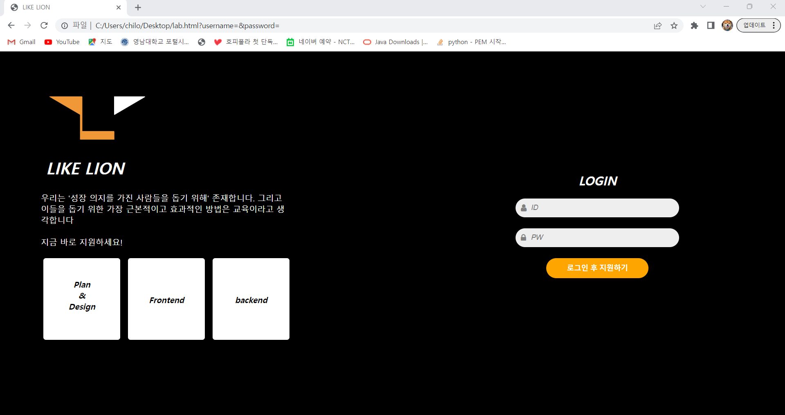

# project01

<!DOCTYPE html>
<link rel="stylesheet" href="https://cdnjs.cloudflare.com/ajax/libs/font-awesome/4.7.0/css/font-awesome.min.css">

<html>
<head>
	<title>LIKE LION</title>
	
</head>
<body>
	<header>
		
         
		<h1><em>LIKE LION </em></h1>
	</header>
	<main>
		
우리는 '성장 의지를 가진 사람들을 돕기 위해' 존재합니다. 그리고 
        이들을 돕기 위한 가장 근본적이고 효과적인 방법은 교육이라고 생 각합니다  
        지금 바로 지원하세요!

        

            
<em><b>Plan   &   Design</b></em>

        

        

            
<em><b>Frontend</b></em>

        

        

            
<em><b>backend</b></em>

        

        

            <form>
              <h2><em>LOGIN</em></h2>
              <label>
                <input type="text" placeholder="ID" name="username" id="username">
                <i class="fa fa-user fa-lg input-icon" aria-hidden="true"></i>
              </label>
               
              <label>
                <input type="password" placeholder="PW" name="password">
                <i class="fa fa-lock fa-lg input-icon" aria-hidden="true"></i>
              </label>
               
              <button type="submit"><b> 로그인 후 지원하기</b> </button>
            </form>
          

	</main>
</body>
</html>
